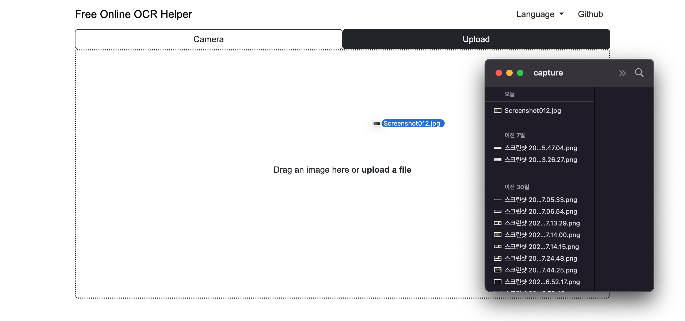

# Free Online OCR Helper

 
 

## Image upload for recognition

  
<code>Drag</code> an image or <code>upload</code> a file

  

  
Set the area and click the <code>'Crop'</code> button

  

  
View the results. <code>Excel download</code> is also available

  

 

## Improve accuracy with image thresholding

  
Check out the different OCR results for <code>each type</code>

  
  

 

## You can even perform OCR without a pre-loaded image!

  
You can perform OCR after capturing images <code>via webcam</code>

  

 
 

## Used Libraries

  <!-- Cropper.js -->
  
  <!-- Tesseract.js -->
  
  <!-- OpenCV.js -->
  
  <!-- ExcelJS -->
  

 
 

## Contact

cchoseonghun@gmail.com